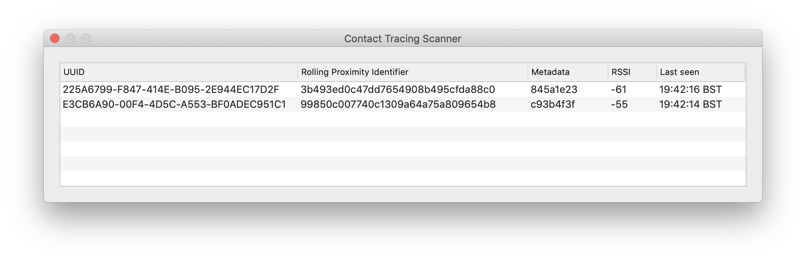

# Contact Tracing Scanner for macOS

_Swift, Interface Builder and CoreBluetooth_

Release: [v1](https://github.com/eddmann/contact-tracing-scanner-macos/releases/tag/1.0) 
Article: [https://eddmann.com/posts/creating-a-contact-tracing-scanner-using-swift-for-macos/](https://eddmann.com/posts/creating-a-contact-tracing-scanner-using-swift-for-macos/)

## Inspiration

- [Exposure Notification Bluetooth Specification](https://covid19-static.cdn-apple.com/applications/covid19/current/static/contact-tracing/pdf/ExposureNotification-BluetoothSpecificationv1.2.pdf)
- [Review of new Apple and Google Contact Tracing Protocol](https://medium.com/@OpenTrace/review-of-new-apple-and-google-contact-tracing-protocol-7696c9203967)
